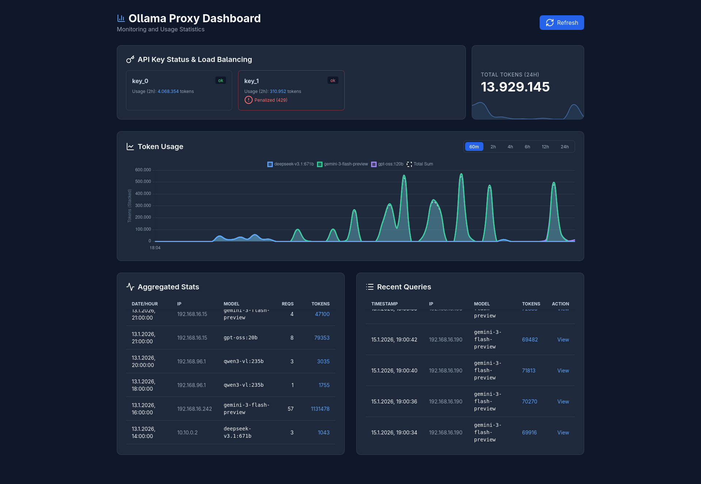

# Ollama Cloud Proxy

Dieser Proxy leitet Anfragen an die offizielle Ollama Cloud API (`https://ollama.com/api`) weiter. Er bietet intelligentes Load-Balancing, Key-Rotation und ein detailliertes Dashboard zur Überwachung der Nutzung.



## Features

- **🚀 Smart Load-Balancing**: Verteilt Anfragen automatisch auf verfügbare API-Keys basierend auf der geringsten Nutzung in den letzten 2 Stunden.
- **🔄 Automatische Key-Rotation**: Erkennt `429 Too Many Requests` Fehler (Quota exceeded) und wiederholt den Request intern sofort mit einem anderen verfügbaren Key.
- **📊 Echtzeit-Dashboard**: Integriertes Web-Interface zur Überwachung von Token-Verbrauch, Key-Status (inkl. Key-Grouping) und Request-Logs.
- **📜 Live Server Logs**: Integrierter Log-Viewer im Dashboard mit Filterfunktion (DEBUG, INFO, WARN, ERROR) für Echtzeit-Einblicke in den Proxy-Status.
- **📈 Nutzungsstatistiken**:
  - Gesamt-Token-Counter (letzte 24h) mit stündlichem Sparkline-Graph.
  - Detaillierter Token-Usage-Graph mit konfigurierbaren Zeitfenstern (10m, 60m, 2h, 4h, 6h, 12h, 24h).
  - Gestapelte Ansicht nach Modellen und Summenlinie.
- **🚦 System Health Indicator**: Echtzeit-Statusanzeige für Proxy-Erreichbarkeit und Ollama Cloud Anbindung direkt im Dashboard.
- **🛡️ Proxy Protection**: Optionaler `PROXY_AUTH_TOKEN`, um unbefugten Zugriff auf deinen Proxy zu verhindern.
- **🌍 Timezone Support**: Alle Statistiken werden automatisch in der lokalen Zeitzone des Nutzers angezeigt (UTC-Backend).
- **📝 Request Logging**: Speichert Request-Bodies (komprimiert) für Debugging-Zwecke (einsehbar im Dashboard).
- **💾 Persistent Logging**: Alle Server-Ausgaben werden rotierend in `data/proxy.log` gespeichert (max. 5MB, 5 Backups).

## Setup

1. **Konfiguration**:
   Erstelle eine `.env` Datei im Stammverzeichnis für grundlegende Einstellungen. Die API-Keys müssen zwingend in einer Konfigurationsdatei hinterlegt werden.

   ### API-Keys konfigurieren (`config/config.yaml`)
   Erstelle oder bearbeite die Datei `config/config.yaml` im Projektordner. Hier werden alle Keys für das Load-Balancing und die Rotation hinterlegt:

   ```yaml
   keys:
     - "key_1"
     - "key_2"
     - "key_3"
   ```

   ### Weitere Optionen (.env)
   ```env
   PROXY_AUTH_TOKEN=ein_geheimes_passwort_fuer_lokal
   ALLOW_UNAUTHENTICATED_ACCESS=false # Wenn true, wird kein Token benötigt
   LOG_LEVEL=INFO # DEBUG, INFO, WARNING, ERROR
   ```

   *Hinweis: Die Umgebungsvariable `OLLAMA_API_KEYS` wird nicht mehr unterstützt. Bitte nutze ausschließlich die `config.yaml`.*

2. **Container starten**:
   ```bash
   docker-compose up -d --build
   ```

## Monitoring & Dashboard

Das Dashboard ist standardmäßig unter `http://localhost:11434/dashboard` erreichbar. Aufrufe der Root-URL (`/`) werden automatisch zum Dashboard weitergeleitet.

### Key Features im Dashboard:
- **Key Status**: Live-Status jedes Keys inklusive aktueller Penalty-Box Informationen (bei Rate-Limits).
- **Server Logs**: Separater Tab mit Live-Streaming der Container-Logs, inklusive Level-Filter und "Clear View" Funktion.
- **Token Counter**: Schnellübersicht der letzten 24h inklusive Trend-Analyse.
- **Recent Queries**: Live-Ansicht der letzten Anfragen mit der Möglichkeit, den Request-Body einzusehen.
- **Aggregated Stats**: Stündlich aggregierte Daten nach Modell und IP-Adresse.

## API Endpunkte

- `/{path:path}`: Transparentes Proxying zur Ollama Cloud.
- `/`: Redirect zum Dashboard.
- `/dashboard`: Web-Interface.
- `/health`: JSON-Status der Proxy-Gesundheit und Cloud-Konnektivität.
- `/stats`: Stündlich aggregierte Statistiken (JSON).
- `/stats/minute`: Minütliche Statistiken für Charts (JSON).
- `/stats/24h`: Zusammenfassung der letzten 24 Stunden.
- `/health/keys`: Detaillierter Gesundheitszustand aller API-Keys.
- `/logs`: JSON-Endpunkt für die aktuell im Speicher gehaltenen Logs.

## Nutzung

Der Proxy verhält sich wie eine lokale Ollama-Instanz.

```bash
curl http://localhost:11434/v1/chat/completions \
  -H "Authorization: Bearer dein_proxy_token" \
  -d '{
    "model": "llama3",
    "messages": [{"role": "user", "content": "Hallo!"}]
  }'
```

## Sicherheit
- Der Proxy leitet alle Pfade intelligent weiter (entfernt doppelte `/api` oder `/v1` Präfixe automatisch).
- Request-Bodies werden lokal in `data/requests` als GZIP gespeichert.
- Die Datenbank `usage.db` befindet sich im `data` Ordner.